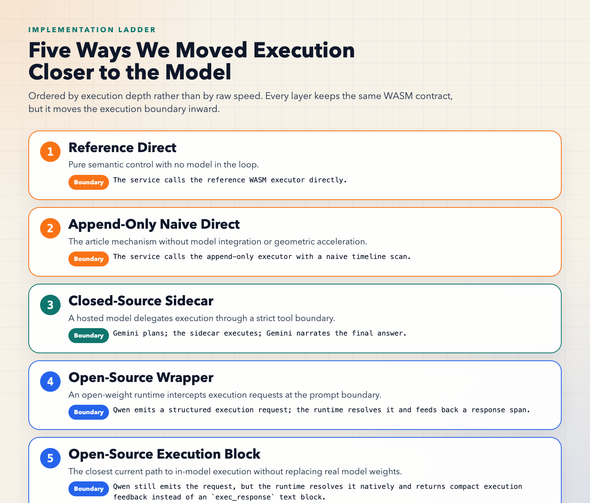
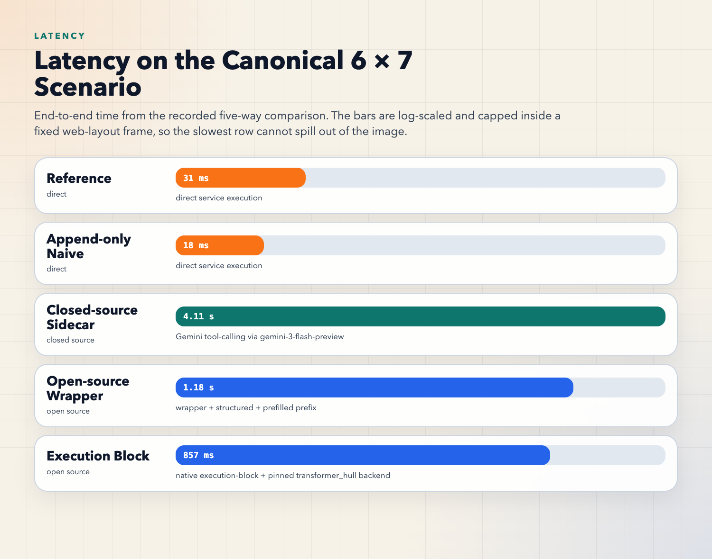
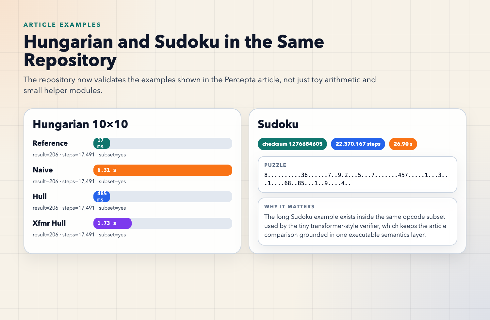
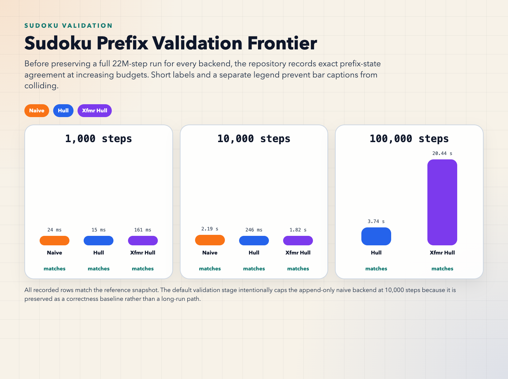
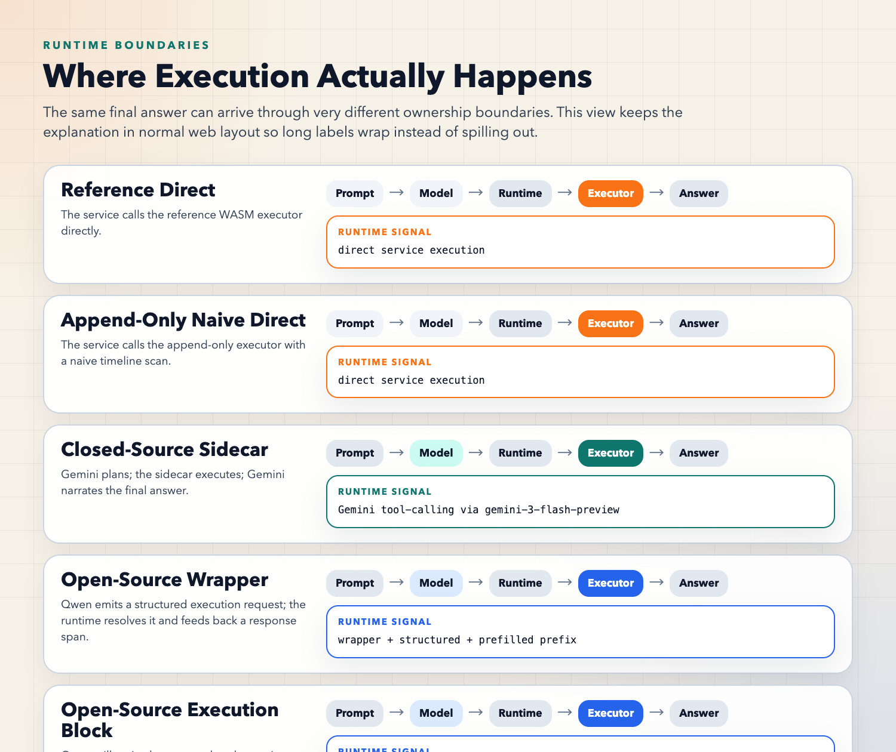
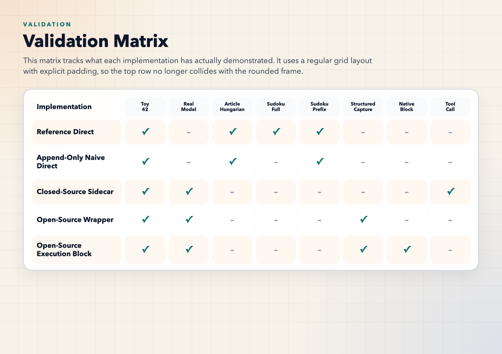

# LLM Computer

Fresh reimplementation inspired by Percepta's article
"Can LLMs Be Computers?".

## Source Article

| Item | Value |
| --- | --- |
| Title | [Can LLMs Be Computers?](https://www.percepta.ai/blog/can-llms-be-computers) |
| Publisher | Percepta |
| Focus | WASM execution inside transformer-style architectures |

## Latest snapshot

| Item | Current status |
| --- | --- |
| Execution paths | `reference_direct`, `append_only_naive_direct`, `closed_source_sidecar`, `open_source_wrapper`, `open_source_execution_block` |
| Latest regression run | `56` passed, `2` skipped on `2026-03-19` |
| Open-source live validation | real cached Qwen-family model |
| Closed-source live validation | `gemini-3-flash-preview` |
| Article examples | Hungarian `10x10` validated; Sudoku checksum validated; Sudoku prefix snapshots validated |
| Articles | English: `docs/five-implementations-article.md`; Chinese: `docs/five-implementations-article.zh-CN.md` |
| Visual assets | CSS-rendered PNG figures plus GIF/MP4 overview under `docs/assets/` |
| Remaining gap | no true execution heads inside a real open-weight model, no execution-only KV path, no WASM-semantics-to-weights compilation |

## Five-way comparison

| Method | Category | End-to-end | Final value | Runtime signal |
| --- | --- | ---: | ---: | --- |
| `reference_direct` | direct | `30.85 ms` | `42` | semantic control |
| `append_only_naive_direct` | direct | `17.52 ms` | `42` | append-only naive retrieval |
| `open_source_wrapper` | open source | `1.178 s` | `42` | `structured_captures=1` |
| `open_source_execution_block` | open source | `857.05 ms` | `42` | `native_execution_rounds=1` |
| `closed_source_sidecar` | closed source | `4.115 s` | `42` | `tool_calls=1` |





## Article example validation

| Example | Backend | Result | Steps | Elapsed | Status |
| --- | --- | ---: | ---: | ---: | --- |
| Hungarian `10x10` | `reference` | `206` | `17,491` | `16.70 ms` | pass |
| Hungarian `10x10` | `append_only_naive` | `206` | `17,491` | `6.305 s` | pass |
| Hungarian `10x10` | `append_only_hull` | `206` | `17,491` | `485.46 ms` | pass |
| Hungarian `10x10` | `transformer_hull` | `206` | `17,491` | `1.729 s` | pass |
| Sudoku checksum | `reference` | `1276684605` | `22,370,167` | `26.895 s` | pass |



## Sudoku prefix validation

| Budget | Backend | Elapsed | Matches reference |
| ---: | --- | ---: | --- |
| `1,000` | `append_only_naive` | `23.62 ms` | yes |
| `1,000` | `append_only_hull` | `15.23 ms` | yes |
| `1,000` | `transformer_hull` | `160.51 ms` | yes |
| `10,000` | `append_only_naive` | `2.185 s` | yes |
| `10,000` | `append_only_hull` | `245.70 ms` | yes |
| `10,000` | `transformer_hull` | `1.825 s` | yes |
| `100,000` | `append_only_hull` | `3.736 s` | yes |
| `100,000` | `transformer_hull` | `20.441 s` | yes |



## Runtime boundary map



## Validation matrix



## Goal

This repository focuses on the parts of the article that are concrete enough to
reproduce from the public write-up:

1. A real WebAssembly binary frontend compiled from WAT example programs.
2. A parsed WASM instruction trace that fits into an autoregressive execution
   trace.
3. Two-dimensional attention-style retrieval implemented as convex-hull support
   point queries.
4. An append-only executor that recovers instruction pointer, locals, and stack
   values from time-indexed retrieval rather than mutable runtime state.
5. Sparse linear memory recovered from append-only writes to byte-addressed
   timelines.
6. Stack depth recovered from append-only per-step deltas via cumulative sums.
7. A minimal C-to-WASM frontend for the subset that the current parser and
   executor support.
8. A tiny transformer-style verifier with static code heads and dynamic state
   heads over append-only traces.
9. A stable sidecar protocol shared by open-source and closed-source adapter
   prototypes.
10. A Qwen3 plus Transformers integration scaffold over the stable sidecar
    protocol.
11. An online cache that is closer to long-trace decoding than a static lookup
    benchmark.

## Non-goals

This repository does **not** claim to fully reproduce the original article:

- It is not a trained transformer model.
- It is only a restricted WebAssembly subset with `local.*`, control flow,
  `i32` arithmetic, comparisons, `if`, `i32.load` / `i32.store`, and simple
  data segments.
- It does not compile arbitrary C code into weights.
- It does not reproduce the article's published throughput numbers.

## Repository layout

- `src/llm_computer/wasm.py`: WAT compilation, WASM parsing, and reference
  execution, plus a minimal `clang -> wasm32` compilation path.
- `src/llm_computer/hull.py`: static and online 2D hull caches.
- `src/llm_computer/examples.py`: small WAT programs compiled to WASM modules.
- `src/llm_computer/executor.py`: append-only WASM executor, stack/local/memory
  timelines, and benchmarks.
- `src/llm_computer/protocol.py`: stable request/response schema for sidecar use.
- `src/llm_computer/gemini_integration.py`: Gemini closed-source integration
  over the tool-style sidecar protocol.
- `src/llm_computer/qwen_transformers.py`: Qwen3 plus Transformers integration
  scaffold over the service protocol.
- `src/llm_computer/gemini_cli.py`: `uv run` entry point for Gemini validation.
- `src/llm_computer/qwen_cli.py`: `uv run` entry point for Qwen3 validation.
  It also supports cached smaller Qwen-family models for smoke validation and
  request-boundary interception experiments.
- `src/llm_computer/article_examples.py`: validation harness for the article's
  Hungarian and Sudoku examples.
- `src/llm_computer/article_story.py`: data-driven article and figure generator
  for the five implementation ladder.
- `src/llm_computer/sudoku_validation.py`: Sudoku-specific checksum and
  prefix-state validation harness.
- `src/llm_computer/comparison.py`: unified five-way comparison harness across
  direct, open-source, and closed-source paths.
- `src/llm_computer/service.py`: execution service boundary over the available
  backends.
- `src/llm_computer/transformer.py`: tiny transformer-style verification for the
  restricted WASM subset with explicit feature extraction, transition, and
  append-only writeback stages.
- `src/llm_computer/integration.py`: open-source and closed-source adapter
  prototypes over the service API.
- `src/llm_computer/__main__.py`: command-line entry point.
- `scripts/`: stage-by-stage validation scripts that preserve the commands used
  to verify each implementation milestone.
- `tests/test_executor.py`: regression tests for timeline retrieval and
  append-only execution.
- `tests/test_service.py`: protocol and service routing tests.
- `tests/test_gemini_integration.py`: regression tests for the Gemini closed-source
  integration.
- `tests/test_integration.py`: adapter tests for open-source and closed-source
  prototypes.
- `tests/test_qwen_transformers.py`: regression tests for the Qwen3
  Transformers orchestration scaffold.
- `tests/test_article_examples.py`: fast regression coverage for the article's
  Hungarian and Sudoku examples.
- `tests/test_article_story.py`: regression coverage for the article generator
  and visual asset emitters.
- `tests/test_sudoku_validation.py`: regression coverage for the Sudoku
  checksum and prefix-state validation harness.
- `tests/test_comparison.py`: regression tests for the five-way comparison
  harness.
- `tests/test_transformer.py`: regression tests for the transformer subset.
- `docs/article-example-validation.md`: validation report for the article's
  Hungarian and Sudoku examples.
- `docs/article-example-validation.json`: raw machine-readable article-example
  validation output.
- `docs/five-implementations-article.md`: the long-form article that explains
  the five implementation ladder with generated figures and animation.
- `docs/five-implementations-article.zh-CN.md`: Chinese translation of the
  five-implementation article.
- `docs/sudoku-result-validation.md`: full-checksum and prefix-state validation
  report for the article's Sudoku example.
- `docs/sudoku-result-validation.json`: raw machine-readable Sudoku validation
  output.
- `docs/benchmark-results.md`: measured results and article-alignment notes.
- `docs/five-way-comparison.md`: latest five-way comparison results.
- `docs/five-way-comparison.json`: raw machine-readable comparison output.
- `docs/open-source-selection.md`: chosen open-source model and runtime
  baseline.
- `docs/gemini-integration.md`: current Gemini integration status and usage.
- `docs/qwen-transformers-integration.md`: current Qwen3 plus Transformers
  integration status and next steps.
- `docs/runtime-validation.md`: `uv` environment and validated runtime commands.
- `docs/stage-validation-log.md`: stage-by-stage validation commands and results.
- `docs/service-protocol.md`: stable execution contract for sidecars and tools.
- `docs/transformer-alignment.md`: current transformer-alignment status and next
  steps.
- `docs/model-integration-plan.md`: open-source and closed-source integration
  plans.
- `docs/assets/`: generated PNG, GIF, and MP4 assets used by the article.
- `visuals/remotion/`: Remotion source for the animated overview plus the
  CSS-rendered still figures used by the article.

## Quick start

```bash
# Requires WABT tools such as `wat2wasm` in PATH.
# Optional: `clang` in PATH for the C-to-WASM example.
uv sync --python 3.12 --extra transformers --extra gemini
uv run llm-computer
uv run python -m unittest discover -s tests -v
uv run llm-computer-compare \
  --model-id Qwen/Qwen2.5-0.5B-Instruct \
  --device mps \
  --gemini-model gemini-3-flash-preview
uv run llm-computer-article-examples
uv run llm-computer-sudoku-validate
uv run llm-computer-article-story
```

## Current status

The implementation is intentionally explicit about what it does and does not
cover. The benchmark output separates:

- static support-point query speed,
- online append-only query+insert speed,
- append-only WASM execution driven by trace retrieval,
- transformer-style verification over the restricted subset.

The current example set includes:

- WAT modules that exercise locals, loops, and memory,
- a memory-backed program,
- a compiled C example that goes through `clang -> wasm32 -> parser -> append-only executor`,
- a transformer-style verification path that now covers locals, control flow,
  memory, and one compiled-C example,
- a sidecar service plus adapter prototypes that keep the execution contract
  stable across open-source and closed-source integration paths,
- a Qwen3 plus Transformers scaffold that turns the stable sidecar contract
  into a real open-source model integration loop,
- a request-boundary interception mode for the open-source runtime that stops
  generation as soon as `</exec_request>` appears and injects the sidecar
  response immediately,
- a deeper structured-request capture mode for the open-source runtime that can
  canonicalize a complete execution JSON object even before the closing tag
  appears,
- a first-class structured prompt mode for the open-source runtime that removes
  the need to ask the model for tagged execution requests,
- a prefilled structured mode where the runtime injects the opening request
  prefix before generation continues,
- an open-source execution-block mode where the orchestrator resolves execution
  requests natively instead of round-tripping through `<exec_response>` text,
- a Gemini closed-source integration that exercises the same sidecar contract
  through explicit tool calls.

Current live-validation status:

- Gemini has been validated end-to-end through a real tool call
- the open-source `Transformers + sidecar` path has been validated end-to-end
  with a real cached Qwen-family model
- the open-source request-boundary interception mode has also been validated
  end-to-end with the same cached Qwen-family model
- the deeper structured-request capture mode has also been validated end-to-end
  with the same cached Qwen-family model
- the built-in structured prompt mode has also been validated end-to-end with
  the same cached Qwen-family model
- the prefilled structured mode has also been validated end-to-end with the same
  cached Qwen-family model
- the open-source execution-block mode has also been validated end-to-end with
  the same cached Qwen-family model
- the unified five-way comparison now succeeds end-to-end across semantic
  control, naive direct execution, open-source wrapper, open-source execution
  block, and closed-source sidecar
- the article's Hungarian `10x10` matching example now succeeds across the
  reference, append-only naive, append-only hull, and transformer-hull paths
- the article's Sudoku example now succeeds under the reference WASM executor
  with the published puzzle string and an independently verified checksum
- the article's Sudoku example now also has a dedicated result-validation
  harness that compares append-only and transformer snapshots against the
  reference path at fixed step budgets
- the transformer path now exposes an explicit execution-layer split between
  feature extraction, transition gating, and append-only writeback
- the repository now includes a generated long-form article with CSS-rendered
  PNG figures and a Remotion overview animation covering all five
  implementation layers
- the repository now also includes a checked-in Chinese translation of that
  article for parallel publication
- `Qwen3-8B` specifically still requires completing the local checkpoint
  download
